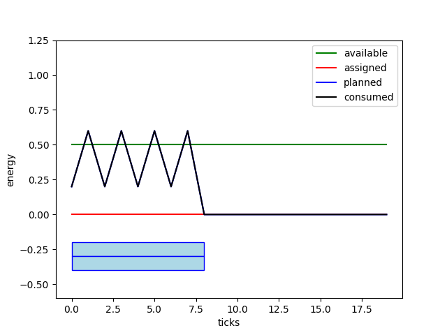
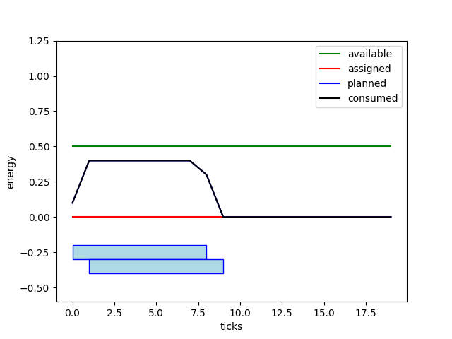
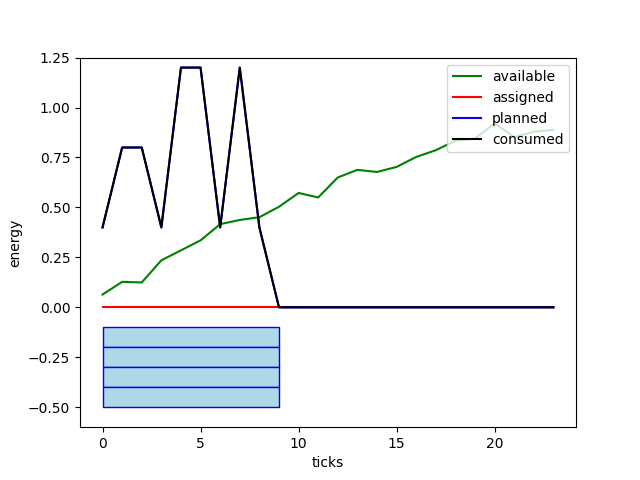

# Household energy optimization with Volttron framework

### Authors
* [@enthyp](https://github.com/enthyp)
* [@DzikiLamer](https://github.com/DzikiLamer)
* [@tomekzaw](https://github.com/tomekzaw)

### 1. Volttron platform installation
Run the following commands:
 * `git clone https://github.com/VOLTTRON/volttron --branch releases/7.x`
 * `cd volttron`
 * `python bootstrap.py`
 * `source env/bin/activate`
 * `vcfg` - to run a single instance of Volttron platform select **Y** to all boolean options presented and default values for all others. This should install Volttron Central module into your environment.
 * `./start-volttron`

You can then verify if your agents are live by running command `vctl status`. You should see a list of all agents running in the system. 

Then you shall proceed to [https://hostname:8443/admin/login.html](https://hostname:8443/admin/login.html) (hostname is what you've chosen during configuration) and create a user account. You can then login to Volttron Central [https://hostname:8443/vc/index.html](https://hostname:8443/vc/index.html).

### 2. Project description
We use Volttron platform as communication medium for multiple agents that cooperate to reduce household energy consumption. 

For the sake of simplicity we consider a single home equipped with a set of photovoltaic (PV) panels and a number of energy receivers, such as e.g. washing machines. Each such installation is represented by a single agent in the system. 

##### 2.1. Central unit
We introduce a single **Hub** agent responsible for scheduling working periods of power consumers. This agent receives data from both suppliers and consumers. On that basis it assigns time slots for the devices that minimize the following quantity:

α * energy_to_buy + β * energy_oversupply + θ * average_delay

For large values of alpha this encourages usage of free energy from the panels.

##### 2.2. Power supply
Agents responsible for communication with PV panels use Volttron pub-sub functionality to publish power supply data, i.e. power and voltage. As of time being, dummy data is used. We assume that PV panels provide us with an estimate supply for the next 6 hours, on which we base our optimisation.

##### 2.3. Power consumption

Power consumer agents publish requests for power to the Hub agent. They transfer the following information:
 * requested energy profile - how much power [kWh] is required over a period of time 
 * maximal delay for the device initialization

### 3. Results
...

Without optimization | With optimization
-- | --
|  |  |

Without optimization | With optimization
-- | --
|  |  |
